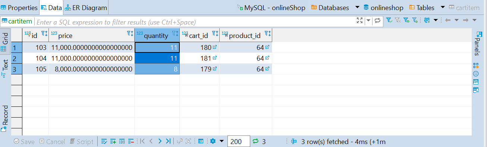

# Shopping-system
A maven web project that mimics the online shopping process. Supports Register, Log in, Log out, Add items to cart, and checkout. 

## Branches
* master: Classic Spring MVC + WebFlow + Security
* boot: SpringBoot + MVC + WebFlow + Security

## Usage:
```r
mvn spring-boot:run
```

## Project Architecture for Registration Process

 


## Project Architecture for High Concurrent Request for Products


## High Concurrent Product Requests Scenario

* When the process time is much greater than the average request interval, if we use normal way of RPC inconsistencies may occur such as over-selling.

* Preload the mysql product information to Redis: Reduce the number of times the product is queried from mysql.

* Use RabbitMQ to deal with high rate of requests: Requests are processed in the order they arrived at the message queues.

* To see an example, run **HighConcurrencyTest** in *CartItemHighConcurrencyTest.java*. In this scenario, we have three customers sending requests at an average rate of 235 milliseconds, with total of 50 requests competing for 30 products, and the process time for a request is 1007 milliseconds (Just let the thread to sleep, actually could be much faster.

* The log file generated from this test is <a href="https://github.com/Shangtingli/shopping-system/blob/redis/renders/example_log.txt">here </a>.

* We can see that the results are synchronous with the database results as follow:



* Also, the message queue rates are as follow:


